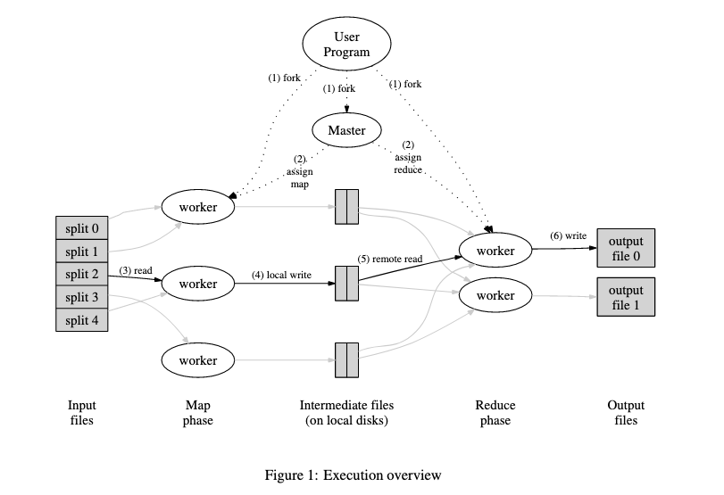

# 1. MapReduce

Users specify a map function that processes akey/value pair to generate a set of intermediate key/valuepairs, and a reduce function that merges all intermediate values associated with the same intermediate key.

## Programming Model

- Map, take an input pair and produce a set of intermediate key/value pairs.
	+ output are buffered in memory

- The MapReduce library groups together all intermediate values with same intermediate key `I` and pass them to the Reduce function
	+ periodically, the buffered pairs are written to local disk, partitioned into R regions by the partitioning function. The location of these buffered pairs on local disk are passed to the master, who forwards these locations to the reduce worker

- Reduce, accepts an intermediate key I and a set of values for that key.
	+ Reduce worker is notified by the master about these locations.

- Master
	+ store the state(idel, in-progress, completed) of map and reduce task
	+ Therefore, for each completed map task, the master stores the locations and sizes of the R inter- mediate file regions produced by the map task. Updates to this location and size information are received as map tasks are completed. The information is pushed incre- mentally to workers that have in-progress reduce tasks.

## Fault Tolerance
- Worker Failure
	+ The master pings every worker periodically. If no response is received from a worker in a certain amount of time, the master marks the worker as failed. Reset completed map task to idle, waiting for reschduling. Completed reduce task don't need to rescheduling.
- Master Failure
	+ periodic checkpoints

## Locality
Network bandwidth is a relatively scarce resource.

It works together with GFS, it divide each file into 64MB blocks and store 3 copies on different machines.

MapReduce master schedule the map task on the machine that contains a replica of the corrsponding input data.

## Backup tasks
One of the common causes that lengthens the total time taken for a MapReduce operation is a “straggler”: a ma- chine that takes an unusually long time to complete one of the last few map or reduce tasks in the computation.

Common cause is CPU, memory, local disk...

When a MapReduce operation is close to completion, the master schedules backup executions of the remaining in-progress tasks. The task is marked as completed whenever either the primary or the backup execution completes.

## Reference
- MapReduce: Simplified Data Processing on Large Clusters
- [mit-course-note: mapreduce](https://pdos.csail.mit.edu/6.824/notes/l01.txt)
