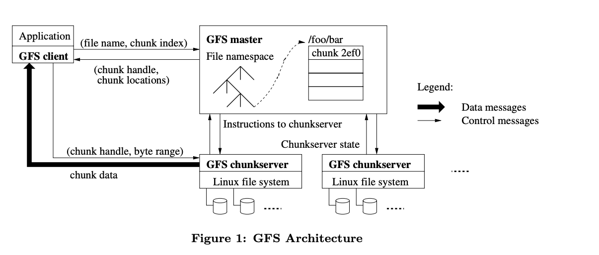

# 3. GFS

- [paper](../paper/3.gfs.pdf)

## Context
Google services needed a **big** fast unified storage system.

- feature
	+ weak consistency
	+ sequential access to huge files; read or append 

## Architecture

- master data(store in RAM and disk)
	+ file name-> array of chunk handles (non-volatile)
	+ handle
		* version (non-volatile)
		* list of chunkServers (volatile)
		* primary chunkServer (volatile)
		* lease expiration time of primary chunkServer (volatile)
	+ read through RAM
	+ write is write through, it will write to both RAM and disk
	+ LOG and checkPoint, flush the data from memory to disk

- read
	+ client send file name and byte offset	of the file(if not cached)
	+ Master finds chunk handle for that offset
	+ Master replies with list of chunkservers only those with latest version
	+ Client caches **chunk handle** + **chunk location**(without data)
	+ Client sends request to nearest chunkserver through chunk handle, offset
	+ chunk server reads from chunk file on **disk**, returns
- append
	+ no primary on server
		* server
			* find up to date replica
			* pick primary, slave, record lease expiration time
			* increment version, flush to disk
			* tells primary, slave the new version number
	+ client talk to primary to append data
		* Primary picks offset
		* all replicas told to write at offset
			* if all replca response success append, reply "yes" to client	
			* if some replica faild to append, reply "no" to client
		* Primary waits for all secondaries to reply, or timeout. Secondary can reply "error" e.g. out of disk space. 		
	+ Client retries from start if error	

## Summary
- good ideas
	+ global cluster file system as universal infrastructure
	+ separation of naming(master) from storage(chunkserver)
	+ sharding for parallel throughput
	+ huge files/chunks to reduce overheads
	+ primary to sequence writes
	+ lease to prevent split-brain chunkserver primaries
- not so good
	+ single master perfoamce
		* ran out of RAM and CPU, especially when server size and file count increasing
		* chunkserver not efficient for small files (big table is solution)
		* consistency is not strict

