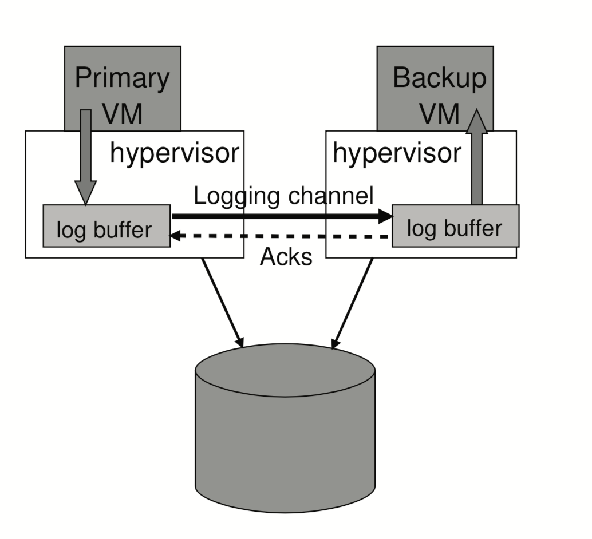
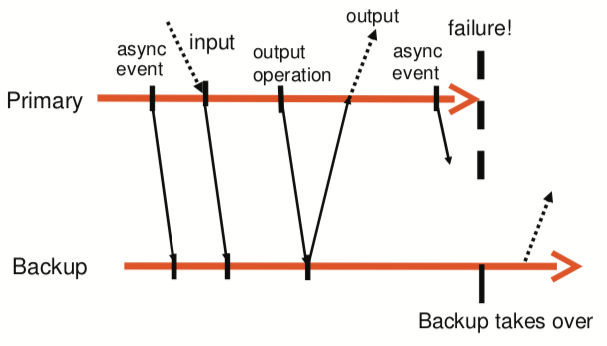

# 4. Primary-Backup replication

## Introduction
* Kinds of failure
	- fail-stop (replication can deal with)
		+ fan stops working, CPU overheats and shuts itself down
		+ power outage or network partition
		+ software notices it is out of disk space and stops
	- hardware bugs or software bugs or human configuration errors(replication cannot deal with)
	- earthquake or city-wide power failure
		+ replicas are physically separated
* Two main replication approaches
	- state transfer
		+ Primary sends entire state to backups
		+ simple but slow to transfer over network
	- replicated state machine
		+ Client send operations to primary
		+ primary sequences and send to backups
		+ all replicas execute all operations
		+ if same start state, same operations, same order, deterministic, then same end state.
		+ faster but more complex
* The definition of State, what level do we want to replicas to be identical
	+ Application state
		- e.g.: database tables, GFS
		- Application code must understand fault tolerance, e.g., forward operation stream
	+ Machine level, e.g. registers and RAM content.
		- requires forwarding of machine events (interrupts, DMA)
		- requires "machine" modifications to send/recv event stream

## Overview of VM-FT
Types of log that affect the VM's state
+ deterministic
	- incoming network packets, disk reads and input from the keyboard and mouse
+ non-deterministic
	- events, e.g. virtual interrupts
	- operations, e.g. reading the clock cycle counter of the processor

Bare metal installed VM hypervisor(VMM), and guest OS is building on top of it.  
Primary sends all external events (client packets) to backup over network "logging channel", carrying log entries.    
If either stops talk to the other, one becomes provide sole service, and stop send log entries to the backup.   

Information on asynchronous events, inputs and output operations must be sent to the backup as log entries and acknowledged, then able to produce the output.

## Reference
- [The design of a practical system for fault-tolerant virtual machines, 2010](../paper/vm-fault-tolerant)
- [mit course note: Primary-Backup Replication](https://pdos.csail.mit.edu/6.824/notes/l-vm-ft.txt)
