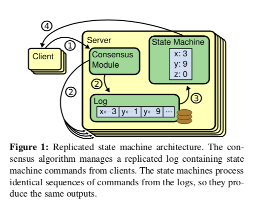
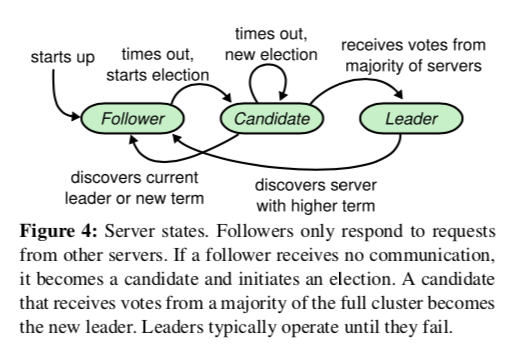
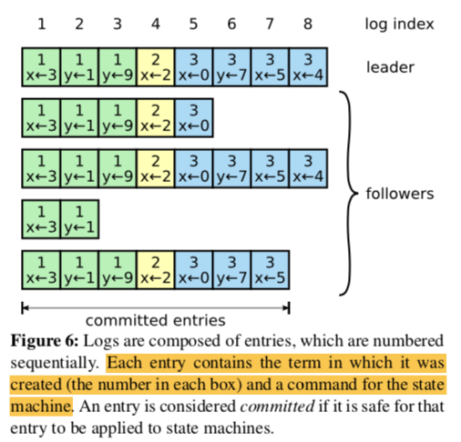

# 6.Raft

- [paper](../paper/6.raft.pdf)
- [source notes](https://pdos.csail.mit.edu/6.824/notes/l-raft.txt)


- Types of replication
	all rely on a single entity to make critical decisions
  * Map/Reduce replicates computation but relies on a single master to organize
  * GFS replicates data but relies on the master to pick primaries
  * VMware FT replicates service but relies on test-and-set to pick primary

But the above application cannot deal with the split brain issue(network partition).

## Replicated State Machine
  

Replicated state machines are typically implemented using a **replicated log**, each server stores a log containing a series of commands, which its state machine executes in order.

Keeping the replicated log consistent is the job of the consensus algorithm. 

Example: Zookeeper


### Raft time diagram of one client command
- client sends Put/Get "command" to k/v layer in leader
- leader adds command to log
- leader sends AppendEntries RPCs to followers
- followers add command to log
- leader waits for replies from a bare majority (including itself)
- entry is "committed" if a majority put it in their logs
		+ committed means won't be forgotten even if failures
		+ majority -> will be seen by the next leader's vote requests
- leader executes command, replies to client
- leader "piggybacks" commit info in next AppendEntries
- followers execute entry once leader says it's committed


### Raft Consensus Algorithm
- Raft servers communicate using remote procedure calls (RPCs)
- Elect a leader, then giving the leader complete responsibility for managing the replicated log. 
- Leader accepts log entries from clients
- Relicates them on other servers
- Tell servers when it is safe to apply log entries to their state machine.

#### Leader Election

- time diagram
	+ Leaders send periodic heartbeats (AppendEntries RPCs that carry no log entries) to all followers in order to maintain their authority. 
	+ If a follower receives no communication over a period of time called the election timeout, then it assumes there is no vi- able leader and begins an election to choose a new leader.
	+ A candidate wins an election if it receives votes from a majority of the servers in the full cluster for the same term.
- how to ensure at most one leader in a term
	+ leader must get "yes" votes from a majority of servers
  	+ each server can cast only one vote per term, first come, first win.
  	+ at most one server can get majority of votes for a given term
- how does Raft avoid split votes
	+ each server picks a random election timeout
- RequestVote handler only votes for candidate who is "at least as up to date"
	+ Candidate has higher term in last log entry, or
	+ Candidate has same last term and same length or longer log	


#### Log replication

- Happy path
	+ The leader appends the command to its log as a new entry
	+ fire appendEntry RPC to all followers in parallel to each of the other servers to replicate the entry.
	+ if majority of the follower store the entry, the leader applies the entry to its state machine and returns the result of that execution to the client. 
- Forces agreement by having followers adopt new leader's log
```
  example:
  S3 is chosen as new leader for term 6
  S3 sends an AppendEntries with entry 13
     prevLogIndex=12
     prevLogTerm=5
  S2 replies false (AppendEntries step 2)
  S3 decrements nextIndex[S2] to 12
  S3 sends AppendEntries w/ entries 12+13, prevLogIndex=11, prevLogTerm=3
  S2 deletes its entry 12 (AppendEntries step 3)
  similar story for S1, but S3 has to back up one farther
```
	+ why was it OK to forget about S2's index=12 term=4 entry? Could new leader roll back *committed* entries from end of previous term?
		* no, the server without the committed log cannot win the election
		* RequestVote handler only votes for candidate who is "at least as up to date" 


### Persistence
Persistence is often the bottleneck for performance, lots of tricks to cope with slowness of persistence:
- batch many new log entries per disk write
- persist to battery-backed RAM, not disk


#### Stateful information
Stateful information is to retrivable when server crash and relaunch.

log[], currentTerm, votedFor, store in non-volatile storage
- log[]
	+ if a server was in leader's majority for committing an entry, must remember entry despite reboot, so any future leader is guaranteed to see the committed log entry
- votedFor
	+ prevent a client from voting for one candidate, then reboot, then vote for a different candidate in the same (or older!) term, could lead to two leaders for the same term
- currentTerm
	+ to ensure terms only increase, so each term has at most one leader to detect RPCs from stale leaders and candidates	


#### Log compaction and Snapshots
when a server crash and reboot, it can replay to get the log[], but log will get to be huge -- much larger than state-machine state, will take a long time to re-play on reboot or send to a new server.

what entries *can't* a server discard?
- un-executed entries -- not yet reflected in the state
- un-committed entries -- might be part of leader's majority


Snapshot diagram:
- service writes snapshot to persistent storage (disk), includes index of last included log entry.
- service tells Raft is is snapshotted through some log index
- Raft discards log before that index


What happens on crash+restart?
- service reads **snapshot**(state + index) from disk
- raft reads peristed log from disk
- service tells Raft to set lastApplied to last included index


### Linearizability

An execution history is linearizable if one can find a total order of all operations, that matches real-time (for non-overlapping ops)

How to evaluate a system's linearizability:
- a history is a reecord of client operations, each with arguments, return value, time of start, time of complete

Example:
```
  |-Wx1-| |-Wx2-|
    |---Rx2---|
      |-Rx1-|
"Wx1" means "write value 1 to record x"
"Rx1" means "a read of record x yielded value 1"      
```
This order satisfies the constraints: `Wx1 Rx1 Wx2 Rx2`, so the history is linearizable.


#### Duplicate RPC detection
What should a client do if a Put or Get RPC times out? - client may retry, which will be very dangerous if the server has executed it, but fail to response.


Solution: duplicate RPC detection
- client picks an ID for each request, sends in RPC
- k/v service maintains table indexed by ID, makes an entry for each RPC, record value after executing
- k/v service if reveive 2nd RPC arrives with the same ID, it's a duplicate, it will generate reply from the value in the table


Problem:
- when to compact the table, it will grows and very costly if server crash and restore.

Idea to keep the duplicate table small:
- one table entry per client, rather than one per RPC
- each client numbers RPCs sequentially
- when server receives client RPC #10, it can forget about client's lower entries, since this means client won't ever re-send older RPCs


Solution: unique id = client id + seq


How does a new leader get the duplicate table?
- all replicas should update their duplicate table as they execute the log.
- so the new elected leader already have the information.


If server crashes, how does it restore its table?
- If no snapshots, replay of log will pupulate the table
- If snapshots, snapshot must contain a copy of the table

Problem: read may get the stale data, it is ok!
Example: 
```
example:
  C1           C2
  --           --
  put(x,10)
               first send of get(x), 10 reply dropped
  put(x,20)
               re-sends get(x), gets 10 from table, not 20

what does linearizabilty say?
C1: |-Wx10-|          |-Wx20-|
C2:          |-Rx10-------------|
order: Wx10 Rx10 Wx20
so: returning the remembered value 10 is correct 
```

## Read-only operations

- Why does the Raft Leader have to commit read-only operations in the log?
	+ because it can avoid leader immediately response to a Get() using the current content
	+ eg: leader crash but relaunch but it doesn't know there is a new leader. So read log also need to get pupulated to majority and get committed before response.
- But if the application is read-heavy, committing Get() takes time. Is there any way to avoid commit for read-only operations?
	+ lease
	+  after each time the leader gets an AppendEntries majority, it is entitled to respond to read-only requests for a **lease period without commiting read-only requests to the log**, i.e. without sending AppendEntries.
	+ a new leader cannot execute Put()s until previous lease period has expired.


