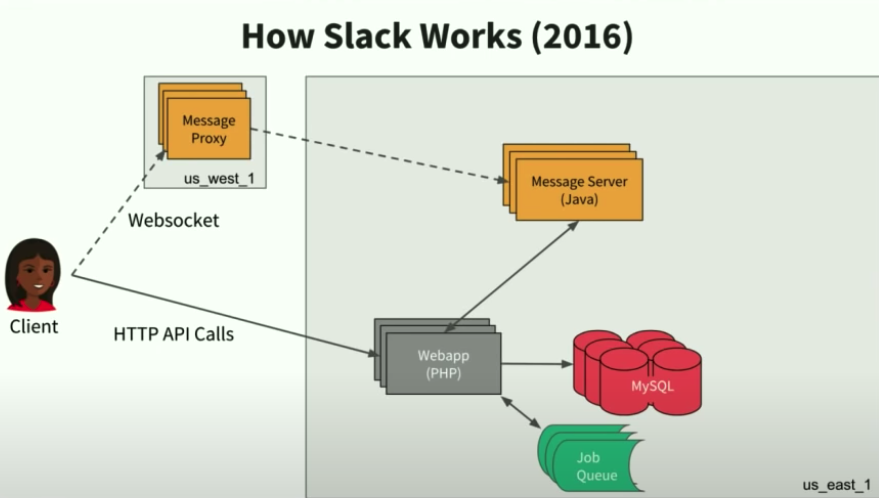

# Slack

## Before scale

## Client/Server Flow
1. Initial Login:
  - client -> webapp
  - webapp return **boot payload** with all metadata(userlist, channel, etc), along with the Message Proxy
  - client establish real time websocket(long live connection, to receive notification, and update, like avatar update)
  - stop contact to webapp directly
2. while connected:
  - push updates via websocket(push from server to client)
  - API call to webapp for channel history, message edit, create channels, etc(push from client to server)

## Workspace sharding
- assign a workspace to a DB and MS shard at creation
- those metadata can be stored in a main DB
- cache the shard metadata in Webapp

## Challenge in 2018
- Model change: shared channel among different organization; different workspace. Enterprise have multiple workspace, with several shared channel.
- Scalability: 2x DAU, 10x DAU in the largest organization, 3x connectivity

## Improvement for scalability
### Edge Cache

- Solution for big boot payload: edge cache(flannel cache), close to user
  + flannel is a global distributed edge cache
  + after router to the flannel that most likely to have the data of the workspace, flannel quickly reply the cached data, for missing data, async to push later, or client call back -> critical for real time feeling.

## Scaling datastores with Vitess

Similar to add a **router layer** between the server and mysql database.

- router the id to the server stored the data
- connections pool is much lighter-weight(memory) than traditional sql connection pool.
- bound with ZooKeeper or etcd, to garantee the consistency of topology

vtgate 可以认为是网关,client 只需要与vtgate 连接即可.
vtgate 会把相应的sql 路由到相应的vttablet 进行查询 执行等.
vtgate 可以启动多个，来做负载均衡.
vttablet 可以认为是在mysql 前面挡了一层，一个vttablet 对应一个mysql 实例.
主要提供连接池、查询重写、查询去重、以及相应的管理操作
vtctl 命令行， 提供管理vitess 的命令等，包括查询master-slave关系，sharding 信息
建表，执行sharding resharding ，执行failover(切换主从关系等)等操作。
vtworker

## Reference
- [Scaling Slack - The Good, the Unexpected, and the Road Ahead](https://www.youtube.com/watch?v=_M-oHxknfnI)
- [Word Version, Scaling Slack](https://www.infoq.com/presentations/slack-scalability-2018/)
- [Vitess](https://jixiuf.github.io/blog/go_vitess.html/)
